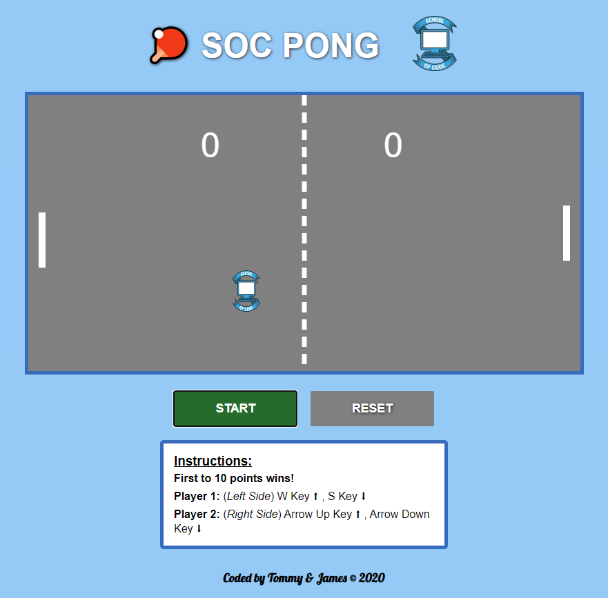

# SOC Pong

A game created as part of a School of Code hackathon.
Coded with HTML5 CSS3 and JavaScript while learning how plan and code in an object oriented way.
The JavaScript code is split into classes and orchestrated from one main.js file.

### To start:

1. Recommend running with live server in VsCode.

---

##### Screenshot

